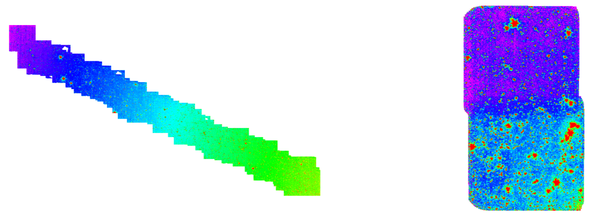

# IRAC-mosaic
Stack Spitzer/IRAC image into a deeper mosaic

This is a note about how to stack the IRAC image together.

I start my real astronomy career from an IRAC survey named [SEDS](https://www.cfa.harvard.edu/SEDS/). Jiasheng patiently helps and teaches me to do crowd field photometry, collect data from each field, built the IRAC selected multi-wavelength catalogue, phot-z, absolute mag, stellar-mass etc. Most importantly, I start to understand the relation between signal and noise, model and data. Until now, Spitzer is my favourite telescope. I feel honour when I joint one Spitzer proposal last year.

## Motivations:

* to have a deeper IRAC image in some deep fields like XMM-LSS, ELAIS-N1, DEEP2-3, E-COSMOS, with recently released data

* to play with IRAC

IRAC image can be mosaic by mopex. In my case, I cannot run mopex. No idea why.

If each step of data reduction is understood clearly, I should be able to reproduce the results. It is not difficult to do it, so I make one pipeline to stack the image. The whole point of this note is to explain each step to future me, in case I forget.

In a paper draft, the process is explained as:

*We download all the archive IRAC Basic Calibrated Data (BCD) images in each field from 
[Spitzer Heritage Archive](https://sha.ipac.caltech.edu/applications/Spitzer/SHA/). Each BCD image size is 5’X5’ with pixel scale 1.2’’. Exposure time of the BCD are in the mode of about 30s, 50s, 100s, and 200s, depending on the observation mode. For each BCD image, the bad pixels from detector or the pixels contaminated by cosmic ray are given in the bimsk, brmsk images individually. We only use the pixel values in the BCD image with the safe flags for the stacking. We estimate and subtract the background of BCD images by the median of the image pixel values. Then, we median the BCD images with the same exposure time individually, and generate the median map $S_i$, and exposure map $T_i$, where $i$ stands for the exposure mode. Finally, we stack the median images $S_i$ with the weight of the $T_i$.*

*footnote{ In most of the case, there are two kinds of the exposure time, one is about 30s, for a large field and shallow survey, the other one is about 100s, for a deeper survey.}*

I upload source code in case I lost it one day.
I use IDL to feel like working with IRAC data.
I use swarp to stack image in a way I can explain.

Spitzer/IRAC data are released as BCD level and PBCD level. The difference between BCD and PBCD is: BCD files are pipeline reduced and calibrated file for each pointing. Image size of each BCD file is 5’ X 5’, same as FoV of IRAC. PBCD files are the stack image of several BCD file in one observation run, include e.g., 3X3 pointing pattern, some dither pattern or other configurations, or one AOR. PBCD Image size is larger than BCD file. Each PBCD folder includes maic.fits, munc.fits, mcov.fits, as the science image, coverage map, uncertainty map. Each BCD folder contains the bcd.fits, cbcd.fits, mrmsk.fits, mimsk.fits, unc.fits, and some other fits. cbcd.fits is more calibrated bcd.fits, so I start with cbcd.fits. Both BCD and PBCD images have excellent astrometry.

Both PBCD and BCD files keep the background. During the observation, detector temperature is increasing, so the background changes. So we can see the [residual offset](https://irsa.ipac.caltech.edu/data/SPITZER/docs/dataanalysistools/cookbook/9/) in the PBCD images:

In the left case, the background can be subtracted by large scale smooth image, but in the right case, the background changes quick in the middle, and slow at some other place, which are not easy to subtracted well at same time. To remove this background changing, we need to go back to the BCD files, and remove the background by individually. FoV of BCD images are smaller, and background offset is easier to remove. 

## Stack methods:

One stacking method is the average with the weight of exposure time. Image stacking is adding the photons at the same position from several fits together, then divided by the total exposure time at each position. The several fits images are the photons that drop to the detector at different time. So this stacking process is to collect the photons from different time to the detector together.

Another stacking method is median. For each pixel position, we have observed several times with several values in the unit of counts/s. Most of the values are about the same, because the flux of this ra, dec from the sky is about the same. Some values may offset because of the bad pixels, cosmic rays, something else, which will bias the average value of the pixel values. Median is believed to be better in removing the artifacts than average. But median has the unit weight. Images with longer exposure time should have a larger weight, and most of the time, should have a more reliable value. When we have lots of images at one position, median and average should give similar results. When the image number is not much, and quite different S/N, median may not give a better result.

So median is suitable to remove the artifacts when applied to a series of images with similar exposure time. Average more like collect the photons. To take advantage of the median and average, I median the BCD images with the same exposure time, so that the artifacts are removed effectively. Then average the median results weighted by the exposure time of each exposure mode.

Exposure mode of IRAC is very limited. For each AOR, IRAC will give a short exposure about shorter than 15s, to remove the residual offset in detector, which is serious for the first exposure. Then the exposure time is about 30s for wide field survey mode or about 100s for the deeper survey mode. At the beginning of the cold mission, there were long exposure mode with 200s per frame, which helps to lower the readout noise by fewer frames. In most case, there are 2 to 4 kinds of exposure time. 

## stacking process:

Spitzer data can be downloaded from [Spitzer Heritage Archive](https://sha.ipac.caltech.edu/applications/Spitzer/SHA/). You can input the ra, dec, Equ 2000, set the radius, 1.5deg at most, select IRAC data bands maybe only BCD data, click Search.  Then you see a page with many data, select all, click Prepare Download, then wait a moment

then download script, download data, unzip the files in a folder, then you can see some folders with the name like r46954240, r46954241, r46954242…

mkdir another folder outside the data folder, cd this folder, put, bcdstack-1-buildlist.pro
, bcdstack-2-bgsub.pro, bcdstack-3-swarp.pro, into it, run them in IDL in the order of 1, 2, 3.

Most of the time, you will get the mosaic images include the science image with the pixel value unit of MJy/sr, exposure time map, and uncertainty map named like I1, I2, xxx.

--------------------------------------------------

What happened in IDL code:

### bcdstack-1-buildlist.pro 

build file lists:

It starts from du -a ../XMMLSS > listfiles/listall.txt, then listall.txt would looks like:

280	../XMMLSS/r37892864/ch1/bcd/SPITZER_I1_37892864_0112_0000_2_bimsk.fits

280	../XMMLSS/r37892864/ch1/bcd/SPITZER_I1_37892864_0140_0000_2_bimsk.fits

584	../XMMLSS/r37892864/ch1/bcd/SPITZER_I1_37892864_0143_0000_2_bcd.fits

80	../XMMLSS/r37892864/ch1/bcd/SPITZER_I1_37892864_0141_0000_2_ptn.log

88	../XMMLSS/r37892864/ch1/bcd/SPITZER_I1_37892864_0113_0000_2_bcd.log

584	../XMMLSS/r37892864/ch1/bcd/SPITZER_I1_37892864_0112_0000_2_bcd.fits

280	../XMMLSS/r37892864/ch1/bcd/SPITZER_I1_37892864_0113_0000_2_bimsk.fits

280	../XMMLSS/r37892864/ch1/bcd/SPITZER_I1_37892864_0141_0000_2_bimsk.fits

584	../XMMLSS/r37892864/ch1/bcd/SPITZER_I1_37892864_0140_0000_2_cbcd.fits

50	../XMMLSS/r37892864/ch1/bcd/SPITZER_I1_37892864_0140_0000_2_ptn.log

88	../XMMLSS/r37892864/ch1/bcd/SPITZER_I1_37892864_0112_0000_2_bcd.log

576	../XMMLSS/r37892864/ch1/bcd/SPITZER_I1_37892864_0141_0000_2_bunc.fits

50	../XMMLSS/r37892864/ch1/bcd/SPITZER_I1_37892864_0142_0000_2_ptn.log

580	../XMMLSS/r37892864/ch1/bcd/SPITZER_I1_37892864_0142_0000_2_bimsk.fits

…

Here you can see the files in bcd folder are fits and log, and named by the band ID, AOR, EXPOSURE ID, DECNUM, pipeline version, type. What we need is 

1, a clear list with only cbcd fits, and corrected by the bimsk, brmsk fits
2, exposure time of each cbcd fits. In my case, I build a fits with all the un-flaged pixel value as the exposure time.
3, skip the cbcd with short exposure time, which happens to have no corresponding mask fits.
4, the uncertainty map corresponding to cbcd fits.
5, listfile for cbcd, unc, exp, fits.

### bcdstack-2-bgsub
After this preparation, we move to bcdstack-2-bgsub.pro, which remove the background by SExtractor, and median.

For one pixel that received some electrons, sometimes it is not easy to tell how many electrons belong to the background.

Spitzer have some idea about the background properties, For IRAC ch1, it is about [0.1 – 0.5 MJy/sr](https://irsa.ipac.caltech.edu/data/SPITZER/docs/irac/iracinstrumenthandbook/10/)

I will use the peak position of the pixel value histogram in each image, or the mod value of the histogram, which should be similar or better than the median pixel value, and the SExtractor estimation is good in the view of non-constant background.

### bcdstack-3-swarp.pro

Finally run bcdstack-3-swarp.pro, which works on:

#### square the unc maps, and class the exposure time.

#### prepare the fits file lists with the same exposure time. 

#### prepare the fits file lists with the same exposure time for median

Then median them by swarp, and name the median results by the IRAC band and exposure time, then write the name of the median results into new text files, to build the file list for the final exptime weighted mosaic.

#### correct the exptime map and the median image values by the pixel_factor which is about 4.

Then swarp them into one fits with the exposure time in the names. The swarp is used for median and pixel scale as 0.6.

Here is one thing we need to take care about the pixel size. The BCD images have pixel size about 1.22 arcsec per pixel, which is about twice 0.6’’, and if we set pixel scale as 0.6, then swarp split the value in one 1.2 arcsec pixel into about four pixels with 0.6’’. The unit of BCD images is MJy/sr, which is surface brightness, not counts, and split one pixel into four do not change the surface brightness. Exposure time per pixel should not change by splitting the pixels. So we need to correct the pixel value by the factor of: (pixelscale_orig/0.6)^2, which is about 4.

The unit of pixels is MJy/sr, which is a unit of surface brightness.

1 MJy = 10^12 uJy

1 sr = 1 rad * 1 rad = 180 deg / pi * 180 deg /pi = (180 * 60 * 60 arcsec / pi)^2 = (180 * 60 * 60 / pixel_scale_arcsec / pi)^2

Then the MJy/sr = 10^12 uJy/sr = 10^12 uJy/(180 * 60 * 60 / pixel_scale_arcsec / pi)^2 / pixel^2 = 10^12 / (180. * 60. * 60. / pixel_scale_arcsec / pi)^2 uJy / pixel^2.

MJy/sr = unit_factor * uJy / pixel^2, 

where the unit_factor = 10^12 / (180. * 60. * 60. / pixel_scale_arcsec / pi)^2, 

and has the value of 8.46160 for pixel_scale_arcsec = 0.6 arcsec, and 34.9840 for pixel_scale_arcsrc = 1.22 arcsec.

So we can change the unit of pixels into uJy (per pixel) by multiply 8.46160 to the 0.6 arcsrc pixel scale images.

#### build the weight map for the final exptime weighted mosaic.

FLUXCONV in header can convert the unit of MJy/sr into DN/s. GAIN in header in unit of e/DN, helps to convert the DN to electrons. So 

electron/s = bcd [MJy/sr] * GAIN / FLUXCONV

then we can define a conversion factor as conv_factor = GAIN / FLUXCONV to change the unit of MJy/sr into electron/s

conv_factor = sxpar(h_bcd, 'GAIN') / sxpar(h_bcd, 'FLUXCONV')

The maps in unit of electron/s can be stacked by average weighted by the exposure map, which applies the idea to collect all the electrons together. If we do so, we still need another factor to convert the unit into MJy/sr.

Assume we have several fits files cover the same target at the same RA, Dec pixel. Assume each fits is flux calibrated. Assume target is a standard star, and should have the same flux as XXX MJy/sr.

Then each BCD fits should have the same flux value in the unit of MJy/sr for this target, but different conv_factor, different exposure time, and thus different number of electrons. When we add the electron together, we are doing like:

(pixel_1 * conv_factor_1 * exptime_1 + pixel_2 * conv_factor_2 * exptime_2 + pixel_3 * conv_factor_3 * exptime_3 + … + pixel_N * conv_factor_N * exptime_N)  = electron_total

Here the pixel_1, pixel_2, pixel_3… in unit of MJy/sr are the pixel values at the same RA Dec in the 1, 2, 3, … fits

We also add exposure time together to get the total exposure time at this pixel:

exptime_1 + exptime_2 +exptime_3 + … + exptime_N = exptime_total

The flux at this pixel in the mosaic image is electron_total / exptime_total, in unit of electron/s.

We already know this pixel have the flux of XXX MJy/sr, which is the same in each BCD images. So we know the stack image should have a conv_factor_all to convert XXX MJy/sr into some value of electron/s:

XXX MJy/sr * conv_factor_all =  electron_total / exptime_total = (XXX MJy/sr * conv_factor_1 * exptime_1 + XXX MJy/sr * conv_factor_2 * exptime_2 + XXX MJy/sr * conv_factor_3 * exptime_3 + … + XXX MJy/sr * conv_factor_N * exptime_N) / (exptime_1 + exptime_2 +exptime_3 + … + exptime_N)

Looking at this equation, we find the XXX MJy/sr  can be eliminated. So the average conv_factor_all for the stacked image is

conv_factor_all = (conv_factor_1 * exptime_1 + conv_factor_2 * exptime_2 + conv_factor_3 * exptime_3 + … + conv_factor_N * exptime_N) / (exptime_1 + exptime_2 +exptime_3 + … + exptime_N) = (conv_factor_1 * exptime_1 + conv_factor_2 * exptime_2 + conv_factor_3 * exptime_3 + … + conv_factor_N * exptime_N) / exptime_total

which is average of the conv_factor_i, weighted by exptime_i. Then we can covert the electron_total / exptime_total into MJy/sr:

Mosaic in unit of MJy/sr = electron_total / exptime_total / conv_factor_all = electron_total / (conv_factor_1 * exptime_1 + conv_factor_2 * exptime_2 + conv_factor_3 * exptime_3 + … + conv_factor_N * exptime_N) 

We put the value of  electron_total here, then we can see the final mosaic results comes from:

(pixel_1 * conv_factor_1 * exptime_1 + pixel_2 * conv_factor_2 * exptime_2 + pixel_3 * conv_factor_3 * exptime_3 + … + pixel_N * conv_factor_N * exptime_N) / (conv_factor_1 * exptime_1 + conv_factor_2 * exptime_2 + conv_factor_3 * exptime_3 + … + conv_factor_N * exptime_N)

In short, the above formula is average the flux [MJy/sr] by the weight of:

sxpar(h_bcd, 'GAIN') / sxpar(h_bcd, 'FLUXCONV') * EXPTIME map

I average the uncertainty map square as the final mosaic uncertainty. The uncertainty of the median is suggested as median absolute deviation (Feigelson et al. 2012). I will build this map after I submit a paper about LSBG.

